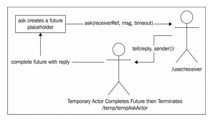
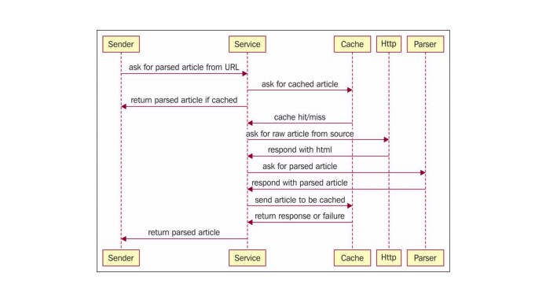
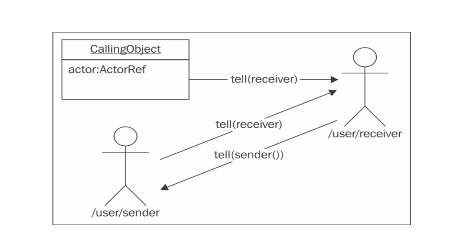
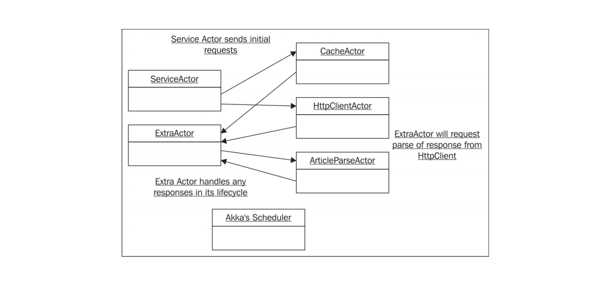

### 3. 传递消息

我们将了解不同的`消息模式`，也就是在不同Actor之间传递消息的不同方法。
我们也会介绍消息传递的`调度方法`(延迟或重复消息的传递)

#### 3.1 项目结构
#### 3.2 消息传递
actor有4个核心消息模式:
1. Ask:向Actor发送一条消息，返回一个`Future`。当 Actor返回响应时，会完成Future。不会向消息发送者的邮箱返回任何消息。
2. Tell:向Actor发送一条消息。所有发送至sender()的响应都会返回给发送消息的Actor。
3. Forward:将接收到的消息再发送给另一个Actor。所有发送至sender()的响应都会返回给原始消息的发送者。
4. Pipe:用于将Future的结果返回给sender()或另一个Actor。如果正在使用Ask
   或是处理一个Future，那么使用Pipe可以正确地返回Future的结果
   
##### 3.2.1 消息不可变
引用 | 可变类型 | 不可变类型
---|---|---
可变引用 | vary bad | bad
不可变引用 | bad | good

Scala中使用`case class`代替class。推荐使用case class是因为它会自动生成一些有用的成员方法，
比如默认的toString()和copy()方法。case class也可以用于Akka`远程访问的序列化`。

无论什么时候，只要需要在线程之间共享数据，就应该首 先考虑将数据定义为不可变

##### 3.2.2 Ask 消息模式

在调用`ask`向 Actor发起请求时，Akka 实际上会在Actor系统中创建一个临时Actor。 接收请求的Actor在返回响应时使用的 sender()引用就是这个临时 Actor。当一个Actor接收到 ask 请求发来的消息并返回响应时，这个临时Actor会使用返回的响应来完成Future 。如下图所示：

项目设计如下：

项目注意点：

    - 在另一个执行上下文中执行回调函数
      为了访问正确的ActorRef，就必须在主线程中调用sender()，然后将结果引用存储在一个变量中。执行匿名函数时，这个变量会被正确地传递至匿名函数的闭包中。有一种更好的办法可以处理这个问题，叫做Pipe
    - 必须设置超时参数
      如果把超时值设置得太短，就可能会使得原本会成功的操作返回错误。如果设置得 太长，又会强制用户在操作由于异常而失败时等待过长的时间。要合理地设置超时，就 需要生产系统中的操作统计数据
      如果用户在使用 Web 应用程序时需要等待超过 2 秒才能看到页面，就会 对他们的使用体验有负面影响
    - 超时错误的栈追踪信息并没有用
      ask 请求超时的时候，异常会由 Akka 的调度器线程抛出，而不是由 Actor 的本地线程抛出
      如果 Actor 抛出了一个意料之外的异常，而没有返回错误， 那么这个错误看上去会像是由于超时引起的，但是实际上却另有原因
      当代码中发生错误时，一定要返回失败消息。如果一个 Actor 抛出了异常，那么它是不会返回消息的。在 Actor 中，代码的编写者负责实现所有 的消息处理逻辑:如果某个 Actor 需要进行响应，Akka 是不会隐式地做任何响应的。当 需要返回响应时，我们必须自己对收到的消息进行响应。
      Ask 是基于 Akka 的一种模式，它非常有用，但是 Akka 中本身没有任何机制可以自 动对消息做出响应，或是向 ask 模式生成的 Future 返回错误。Ask 模式创建了一个 Scala Promise 以及一个临时的 Actor，用于接收响应，并完成 Promise。并没有任何机制能够 使得临时Actor知晓另一个Actor中发生的异常，所以如果我们不对ask模式创建的临时 Actor 返回任何响应的话，它就无法完成 Promise，响应的 Future 就会发生超时错误
    - Ask 的额外性能开销
      首先，ask 会导致 Akka 在/temp 路径下新建一个临时 Actor。这个临时 Actor 会等待从接收 ask 消息的 Actor 返回 的响应。其次，Future 也有额外的性能开销。Ask 会创建 Future，由临时 Actor 负责完成。 这个开销并不大，但是如果需要非常高频地执行 ask 操作，那么还是要将这一开销考虑 在内的。Ask 很简单，不过考虑到性能，使用 tell 是更高效的解决方案

      ##### 3.2.3 tell

`Tell`通常被看做是一种`fire and forget` 消息传递机制，无需指定发送者。不过通过一些巧妙的方法，也可以使用 tell 来完成`request/reply`风格的消息传递 

项目设计如下：

