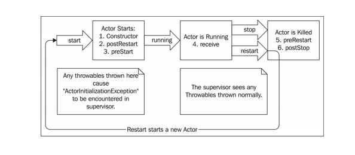
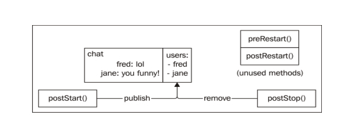

### 4 Actor的生命周期——处理 状态与错误
    分布式计算的误区
    当Actor运行失败时会发生什么
    如何通过监督Actor来处理失败
    如何利用become()以及有限自动机来修改Actor的行为

#### 4.1 分布式计算的8个误区
##### 4.1.1 网络是可靠的
akka通过提高网络通信的抽象层次为我们提供了`位置透明性`

##### 4.1.2 没有延迟
在网络上传输消息是需要时间的，返回响应同样需要时间。主机名会被解析成IP地址(通过DNS)，IP地址会被解析成接收方的MAC地址(通 过 ARP)，并通过握手建立 TCP 连接，然后才开始传输数据。通过 TCP 传输的数据以连 续的包发送，会接收到返回的认证包。

相较于发送很多包含小型消息的请 求，更好的做法是减少请求的数量，增大每个请求包含消息的大小。

在开发时使用本地机器内存中的对象来进行测试时没有问题的任务，一定 要考虑网络引入的延迟，以及网络延迟对用户体验的影响。

##### 4.1.3 带宽是无限的
网络也是有容量的,网络上传输的东西越多，通信被噪声数据影响的可能性就越大,花的时间也就越长。

对于延迟，我们讨论了如何在数据库中支持用`单个消息处理多个`SetRequest和GetRequest，以减少网络上请求的数量。而对于带宽，我们则要努力`减少网络上消息的大小`。在HTTP通信中，经常会使用Gzip来减少每个请求中包含的数据量。在大型的分布式系统中，经常会使用能够在CPU上快速执行的`压缩算法`，比如Snappy和 LZO(例 如，Cassandra 将 LZO 用于节点内部的通信)。

压缩也是有开销的:它会消耗CPU资源。有一些专用的算法把重点放在`压缩效率`，而非`压缩比`上

##### 4.1.4 网络是安全的
永远都可以读取我们在网络上发送的数据，所以需要确保使用`安全加密算法`(如 AES-256)对传输的敏感信息进行保护，并且小心地`保存处理密钥`。

要把这一点应用到数据库，就要支持`对通信进行加密`，并且`验证发送者的身份`。

##### 4.1.5 网络拓扑不会改变
如果系统依赖于特定的IP地址，那么就做出了错误的假设:网络不会发生变化。

使用`DNS`或者`Zookeeper`等技术提供的`服务注册`来减少这个问题带来的影响，不过重要的是:要意识到，网络是会发生变化的。

##### 4.1.6 只有一个管理员
##### 4.1.7 网络传输没有开销
将数据向下传递到传输层也是有开销的。而数据序列化、数据压缩、将数据压入 TCP 缓冲区以及建立连接都要消耗资源。网络上的任何操作都是有开销的。

无论是在互联网还是云基础设施中，对网络的使用都是要花费真金白银的。基础设 施的维护和云服务的使用都是有开销的。

##### 4.1.8 网络是同构的

#### 4.2 错误
##### 4.2.1 隔离错误
假设每个组件都是一个定时炸弹，那么我们希望能够确保无论其中任何一个发生爆炸，都不会引发`链式反应`.
保持系统在发生错误时仍能运行的方法之一就是实现各组件的冗余性，确保不存在`单点故障`

##### 4.2.2 监督
`监督(supervision)`的核心思想就是把对于失败的响应和可能引起失败的组件分隔开，并且把可能发生错误的组件通过`层级结构`来组织，以便管理。

###### 监督的层级结构
Akka使用`Actor层级结构`来描述监督，`父Actor`负责监督`子Actor`。Actor的路径结构就展示了它的层级结构

位于Actor层级结构顶部的是路径为/的`根Actor`。然后是路径为/user的`守护Actor`。 使用`actorSystem.actorOf()`函数创建的所有Actor都是守护Actor的子Actor(/user/yourActor)。

如果在一个Actor内部创建另一个Actor，那么可以通过调用`context().actorOf`使得新建的Actor成为原Actor的子Actor。这个新建的Actor就成为了Actor树结构中的下一个叶节点(/user/yourActor/newChild)

根Actor下面还有其他Actor层级结构。系统操作相关的Actor在路径为/system的`系统守护Actor`下面。路径/temp下面还包含了一个临时的Actor层级结构，用于完成Future的临时Actor就处于这个子树中

每个负责监督其他Actor的Actor都可以`自行定义监督策略`。
###### 监督策略
    继续(resume):Actor 继续处理下一条消息
    停止(stop):停止Actor，不再做任何操作
    重启(restart):新建一个Actor，代替原来的Actor
    向上反映(escalate):将异常信息传递给下一个监督者
###### 定义监督策略 

    Actor 运行过程中抛出异常:restart() 
    Actor 运行过程中发生错误:escalate()
    Actor 初始化过程中发生异常:stop()
在默认监督策略中还定义了另一种情况:`ActorKilledException`。如果Actor被“杀”(kill)了，那么这个Actor的监督者会接收到一个ActorKilledException，执行`stop()`会接收到该异常。

所有的监督事件实际上都发生在`/system`路径下面的Actor中

默认监督策略
```scala
  //FaultHandling.scala
  final val defaultDecider: Decider = {
    case _: ActorInitializationException ⇒ Stop
    case _: ActorKilledException         ⇒ Stop
    case _: DeathPactException           ⇒ Stop
    case _: Exception                    ⇒ Restart
  }
```

###### Actor 生命周期 
    prestart():在构造函数之后调用
    postStop():在重启之前调用
    preRestart(reason, message):默认情况下会调用postStop()
    postRestart():默认情况下会调用preStart()  
在Actor生命周期中各事件的发生顺序如图:


假设有一个聊天应用程序，每个用户都用一个Actor来表示，而Actor之间的消息传递就表示了用户之间的聊天。当一个用户`进入`聊天室的时候，就启动了一个Actor，并发送一条消息，更新聊天室中的用户名单。
当一个Actor`停止`的时候，发送另一条消息，将该用户从聊天室中显示的当前活跃名单中删除。如果使用默认实现，那么要是Actor遇到了异常并且重启，那么就会先将该用户从聊天窗口中删除，再将其添加进去。
我们可以重写preRestart和postRestart方法，这样用户就只会在真正加入或离开聊天室的时候才被添加或删除到名单中.



    NOTICE:
    要注意的是 preRestart 和 postRestart 只在重启的时候才会被调用。
    它们默认调用了 preStart 和 postStop，但是调用它们的时候就不再直接调用 preStart 和 postStop 了。
    这样我们就能够决定，到底是只在 Actor 启动或停止的时候调用一次 preStart 和 postStop，
    还是每次重启一个 Actor 的时候就调用 preStart 和 postStop。

###### 重启和停止时的消息处理
可以定义监督策略，在抛出异常前重新尝试发送失败的消息，重试次数没有限制。也可以设置时间限制，比如最多重试 10 次或 1 分钟，只要达到其中任一限制就停止重试.

###### 终止或 kill 一个 Actor
    调用 ActorSystem.stop(actorRef)
    调用 ActorContext.stop(actorRef)
    给 Actor 发送一条 PoisonPill 消息，会在 Actor 完成消息处理后将其停止
    给Actor发送一条kill消息，会导致Actor抛出ActorKilledException异常
`context.stop`或`system.stop`会导致 Actor 立即停止。发送`PoisonPill`消息则会在Actor 处理完消息后将其停止。不同的是，`kill`不会马上直接停止 Actor，而是会导致 Actor 抛出一个`ActorKilledException`，这个异常由监督者的行为来处理

###### 生命周期监控 和 DeathWatch
Actor也可以对`其他任何Actor进行监督`。通过调用`context.watch(actorRef)`注册后，Actor就能够监控另一个Actor的终止，而调用`context.unwatch(actorRef)`就可以取消监控注册。如果被监控的Actor停止了，负责监控的Actor就会收到一条`Terminated(ActorRef)`消息

###### 安全重启
构建响应式系统时，要把失败处理列入设计考虑要素之中。我们要确保系统能够对 失败情况做出正确的响应.
启动 Actor 的时候没有处理失败情况，启动之后就对 Actor 的状态进行初始化。如果向 Actor 发送一些初始化消息，而消息中的信息对于 Actor 的状态至关重要，那么这些信息有可能会在重启的过程中丢失.

可以编写一个`监督策略`，也可以使用 Akka 生命周期的`监控功能(DeathWatch)`来对这些失败情况做出响应。但是问题在于，我们只是为了这个简单的初始化消息，
就必须要立刻在客户端中处理错误情况，而且有可能会在处理的过程中犯下一些错误。更好的实现方式是通过`Props`把初始化信息传递给 Actor 的构造函数

Actor 现在可以从`构造函数`中获取所有信息，并且自动连接。如果 我们开始向 Actor 发送消息，然后 Actor 重启的话，由于构造函数的参数中包含了连接信息，因此 Actor 能够正确地从错误中恢复。不过如果 Actor 在`初始化的过程中发生了异常`,
那么`默认的监督机制会停止Actor`。所以，有一种情况是:如果 Actor 已经处在运行中，那么就能够安全地重新启动;但是如果无法 完成初始化，我们就必须编写额外的代码实现`监督策略`，来处理 Actor 无法在启动时连 接到数据库的情况。

我们不希望Actor在初始化的过程中发生错误，而是会给Actor`发送一条初始化消息`，然后在Actor运行的过程中处理状态的变化。可以在`preStart()`中`向Actor自己发送一条Connect消息`来达到这一效果.
Actor 只在运行中才可能会出现错误，而且能够成功重启。所以就可以不断尝试连接数据库直到连上为止了。

读者可能会觉得应该在`preRestart`方法中给自己发送Connect (host, port) 消息。如果 Actor 出于任意原因丢弃了这条消息(可能是因为`邮箱已满`，又或者是由于`重启导致了消息丢失`)，那么这条Connect消息还是可能会丢失。
对于重要的Actor功能，使用构造函数来初始化更简单，也更安全。

上面的介绍中还没有涉及到一些细节和问题。
- 首先,我们没有处理 Actor 在连接成功之前接收到的消息;
- 其次，如果 Actor 长时间无法连接的话，邮箱可能会被填满。

#### 4.3 状态
Actor 能够`安全地存储状态`，它允许我们使用`无锁`的方式并发处理状态。现在我们就来介绍 Actor 如何通过不同的状态来改变它的行为。

可以使用几种不同的机制来改变 Actor 的行为:
    
    基于 Actor 状态的条件语句
    热交换(Hotswap):become()和 unbecome()
    有限自动机

##### 4.3.1 在线/离线状态
###### 转移状态
###### 在状态之间暂存消息(stash)
Actor 也经常会处在一个`无法处理某些消息`的状态。如果数据库客户端离线了，那么在重新上线之前，它都无法处理任何消息。我们可以选择`不断重新建立客户端的连接`，直到连接成功为止。在这种情况下，在成功连接之前，客户端会丢弃收到的所有消息。另一种做法是把客户端无法处理的消息`先放在一旁`，等到客户端`恢复连接状态之后再做处理`。

Akka 提供了一种叫做 `stash` 的机制来支持这一功能。stash 消息会把消息暂存到一个`独立的队列`中，该队列中存储目前无法处理的消息.
`unstash`则把消息`从暂存队列中取出`，`放回邮箱队列`中，Actor 就能继续处理这些消息了。

    NOTICE:
    要注意的是，虽然 stash() 和 unstash()在希望快速改变状态的时候使用起来非常方便，但是 stash 消息的状态一定要和某个时间限制进行绑定，否则就有可能填满邮箱。
##### 4.3.2 条件语句
```scala
var online = false
def receive = {
  case x: GetRequest =>
    if(online)
      processMessage(x)
    else
      stash()
  case _: Connected =>
    online = true
    unstash()
  case _: Disconnected =>
    online = false
}
```

##### 4.3.3 热交换(Hotswap):Become/Unbecome
 Actor 的 context()中，有两个方法
    
    become(PartialFunction behavior):这个方法将 receive 块中定义的行为修改为一个新的 PartialFunction。
    unbecome():这个方法将 Actor 的行为修改回默认行为
代码示例:
```scala
def receive = {
  case x: GetRequest =>
    stash()
  case _: Connected =>
    become(online)
    unstash() 
}
def online: Receive = {
  case x: GetRequest =>
    processMessage(x)
  case _: Disconnected =>
    unbecome() 
}
```
相较于条件语句,这种写法可读性更高,更优雅

我们可以定义任意数量的 receive 块，并相互切换。热交换基本上可以处理 Actor 的任何行为修改。

###### stash 泄露
如果要花很长时间才能接收到 Connected 消息，或者压根就收不到 Connected 消息，那么 Actor 就会不断地 stash 消息，最终导致应用程序`内存耗尽`，或者导致邮箱开始`丢弃消息`
无论何时，只要使用了 stash()， 都最好设置一个限制，指定最长多少时间或者最多接收到多少消息后就不能再 stash

###### 有限自动机(Finite State Machine，FSM)
FSM 中也有状态以及基于状态的行为变化。跟热交换比起来，FSM 是一个更重量级的抽象概念，需要更多的代码和类型才能够实现并运行。所以通常来说，热交换是一个更简单、可读性更高的选择。

###### 定义状态
自己定义状态
    Disconnected:离线，队列中没有任何消息
    Disconnected and Pending:离线，队列中包含消息
    Connected:在线，队列中没有消息
    Connected and Pending:在线，队列包含消息

###### 定义状态容器
状态容器就是`存储消息`的地方。FSM 允许我们定义状态容器，并且在切换状态时修改状态容器。


##### 4.3.4 通过重启转移状态


