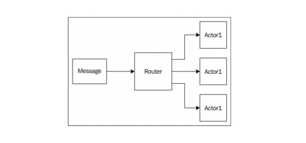
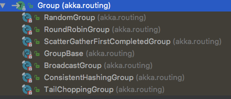
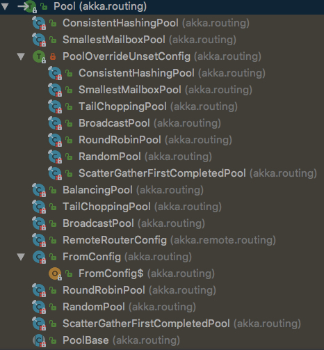

### 5. 纵向扩展
纵向扩展指的是尽可能地利用单台机器上的硬件资源。
Akka 中提供了两种可以用来进行`多核并行`编程的抽象:`Future` 和 `Actor`
#### 5.4 并行编程
##### 5.4.1 使用Future并行编程
##### 5.4.2 使用actor并行编程
###### Router介绍
Router是一个用于`负载均衡`和`路由`的抽象。创建 Router 时，必须要传入一个 `Actor Group`，或者由 Router 来创建一个 `Actor Pool`。

有两种用来创建Router背后的Actor集合的机制。一种是由Router来创建这些Actor(一个Pool)， 另一种是把一个 Actor 列表(Group)传递给 Router。

当 Router 接收到消息时，就会将消息传递给 Group/Pool 中 的一个或多个 Actor。有多种策略可以用来决定 Router 选择下一个消息发送对象的顺序。 

- Actor运行在本地，我们需要一个包含多个Actor的Router 来支持使用多个CPU核进行并行运算
- 如果Actor运行在远程机器上，也可以使用Router 在服务器集群上分发工作 

如下图所示


###### 路由逻辑

详见 `akka.routing.Group` 的子类：


和 `akka.routing.Pool` 的子类：



| 路由策略           | 功能                                                         |
| :----------------- | :----------------------------------------------------------- |
| Round Robin        | 依次向 Pool/Group 中的各个节点发送消息，循环往复。Random——随机向各个节点发送消息 |
| Smallest Mailbox   | 向当前包含消息数量最少的 Actor 发送消息。由于远程 Actor 的邮箱大小未知，因此假设它们的队列中已经有消息在排队。所以会优先将消息发送给空闲的本地 Actor。 |
| Scatter Gather     | 向 Group/Pool 中的所有 Actor 都发送消息，使用接收到的第一个响应，丢弃之后收到的任何其他响应。如果需要确保能够尽快收到一个响应，那么可以 使用 scatter/gather。 |
| Tail Chopping      | 和 Scatter/Gather 类似，但是 Router 并不是一次性向 Group/Pool 中的所有 Actor 都发送一条消息，而是每向一个 Actor 发送消息后等待一小段时间。有着和 Scatter/Gather 类似的优点，但是相较而言有可能可以减少网络负载。 |
| Consistent Hashing | 给 Router 提供一个 key，Router 根据这个 key 生成哈希值。使用这个哈希值 来决定给哪个节点发送数据。想要将特定的数据发送到特定的目标位置时， 就可以使用哈希。在下章中，我们将讨论更多有关一致性哈希的问题。 |
| BalancingPool      | BalancingPool 这个路由策略有点特殊。只可以用于本地 Actor。多个 Actor 共享同一个邮箱，一有空闲就处理邮箱中的任务。这种策略可以确保所有 Actor 都处于繁忙状态。对于本地集群来说，经常会优先选择这个路由策略。 |

我们也可以实现自己的路由策略 

###### 向同一个 Router Group/Pool 中的所有 Actor 发送消息 

```scala
router ! akka.routing.Broadcast(msg)
```

###### 监督 Router Pool 中的路由对象 

