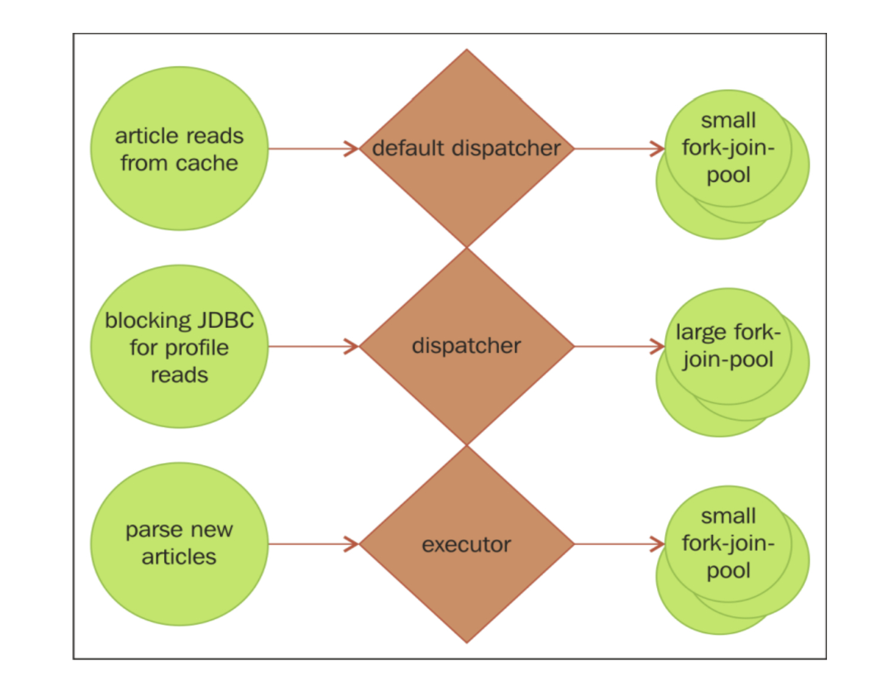

### 5. 纵向扩展
纵向扩展指的是尽可能地利用单台机器上的硬件资源。
Akka 中提供了两种可以用来进行`多核并行`编程的抽象:`Future` 和 `Actor`
#### 5.4 并行编程
##### 5.4.1 使用Future并行编程
##### 5.4.2 使用actor并行编程
###### Router介绍
Router是一个用于`负载均衡`和`路由`的抽象。创建 Router 时，必须要传入一个 `Actor Group`，或者由 Router 来创建一个 `Actor Pool`。

有两种用来创建Router背后的Actor集合的机制。一种是由Router来创建这些Actor(一个Pool)， 另一种是把一个 Actor 列表(Group)传递给 Router。

当 Router 接收到消息时，就会将消息传递给 Group/Pool 中 的一个或多个 Actor。有多种策略可以用来决定 Router 选择下一个消息发送对象的顺序。 

- Actor运行在本地，我们需要一个包含多个Actor的Router 来支持使用多个CPU核进行并行运算
- 如果Actor运行在远程机器上，也可以使用Router 在服务器集群上分发工作 

如下图所示


###### 路由逻辑

详见 `akka.routing.Group` 的子类：


和 `akka.routing.Pool` 的子类：


| 路由策略           | 功能                                                         |
| :----------------- | :----------------------------------------------------------- |
| Round Robin        | 依次向 Pool/Group 中的各个节点发送消息，循环往复。Random——随机向各个节点发送消息 |
| Smallest Mailbox   | 向当前包含消息数量最少的 Actor 发送消息。由于远程 Actor 的邮箱大小未知，因此假设它们的队列中已经有消息在排队。所以会优先将消息发送给空闲的本地 Actor。 |
| Scatter Gather     | 向 Group/Pool 中的所有 Actor 都发送消息，使用接收到的第一个响应，丢弃之后收到的任何其他响应。如果需要确保能够尽快收到一个响应，那么可以 使用 scatter/gather。 |
| Tail Chopping      | 和 Scatter/Gather 类似，但是 Router 并不是一次性向 Group/Pool 中的所有 Actor 都发送一条消息，而是每向一个 Actor 发送消息后等待一小段时间。有着和 Scatter/Gather 类似的优点，但是相较而言有可能可以减少网络负载。 |
| Consistent Hashing | 给 Router 提供一个 key，Router 根据这个 key 生成哈希值。使用这个哈希值 来决定给哪个节点发送数据。想要将特定的数据发送到特定的目标位置时， 就可以使用哈希。在下章中，我们将讨论更多有关一致性哈希的问题。 |
| BalancingPool      | BalancingPool 这个路由策略有点特殊。只可以用于本地 Actor。多个 Actor 共享同一个邮箱，一有空闲就处理邮箱中的任务。这种策略可以确保所有 Actor 都处于繁忙状态。对于本地集群来说，经常会优先选择这个路由策略。 |

我们也可以实现自己的路由策略 

###### 向同一个 Router Group/Pool 中的所有 Actor 发送消息 

```scala
router ! akka.routing.Broadcast(msg)
```

###### 监督 Router Pool 中的路由对象 

如果使用 Pool 的方式创建 Router，由 Router 负责创建 Actor，那么这些路由对象会 成为 Router 的子节点。创建 Router 时，可以给 Router 提供一个自定义的监督策略。

使用 Group 方法创建 Router 的时候传入了事先已经存在的 Actor，所以没有办 法用 Router 来监督 Group 中的 Actor。


#### 5.5 使用 Dispatcher

##### 5.5.1 Dispatcher 解析 

Dispatcher 将如何执行任务与何时运行任务两者解耦。一般来说，Dispatcher 会包含一 些线程，这些线程会负责`调度并运行任务`，比如处理 Actor 的消息以及线程中的 Future 事件。 Dispatcher 是 Akka 能够支持`响应式编程`的关键，是负责完成任务的机制。 

所有 `Actor 或 Future `的工作都是由` Executor/Dispatcher `分配的资源来完成的 .


```scala
system.dispatcher //actor system's dispatcher
system.dispatchers.lookup("my-dispatcher"); //custom dispatcher
```
由于我们能够创建并获取这些基于 Executor 的 Dispatcher，因此可以使用它们来定义 `ThreadPool/ForkJoinPool` 来隔离运行任务的环境。

##### 5.5.2 Executor

Dispatcher 基于 Executor，所以在具体介绍 Dispatcher 之前，我们将介绍两种主要的 Executor 类型:`ForkJoinPool` 和 `ThreadPool`。

ThreadPool Executor有一个`工作队列`，队列中包含了要分配给各线程的工作。线程 空闲时就会从队列中认领工作。由于线程资源的创建和销毁开销很大，而 ThreadPool 允许线程的重用，所以就可以`减少创建和销毁线程的次数`，提高效率。

ForkJoinPool Executor 使用一种`分治算法`，递归地将任务分割成更小的子任务，然后 把子任务分配给不同的线程运行。接着再把运行结果组合起来。由于提交的任务不一定都能够被递归地分割成 ForkJoinTask，所以 ForkJoinPool Executor 有一个`工作窃取算法`， 允许空闲的线程“窃取”分配给另一个线程的工作。由于工作可能无法平均分配并完成， 所以工作窃取算法能够`更高效地利用硬件资源`。

ForkJoinPool Executor几乎总是比ThreadPool的Executor效率更高，是我们的默认选择。

##### 5.5.3 创建 Dispatcher
要在 `application.conf` 中定义一个 Dispatcher，需要指定 Dispatcher 的类型和 Executor。
```hocon
my-dispatcher {
  type = Dispatcher
  executor = "fork-join-executor"
  fork-join-executor {
    parallelism-min = 2 #Minimum threads
    parallelism-factor = 2.0 #Maximum threads per core
    parallelism-max = 10 #Maximum total threads
  }
  throughput = 100 #Max messages to process in an actor before moving on.
}
```
有四种类型的 Dispatcher 可以用于描述如何在 Actor 之间共享线程
    
    Dispatcher:默认的 Dispatcher 类型。将会使用定义的 Executor，在 Actor 中处
    理消息。在大多数情况下，这种类型能够提供最好的性能。
    
    PinnedDispatcher:给每个 Actor 都分配自己独有的线程。这种类型的 Dispatcher
    为每个 Actor 都创建一个 ThreadPool Executor，每个 Executor 中都包含一个线程。 
    如果希望确保每个 Actor 都能够立即响应，那么这似乎是个不错的方法。
    可以在单个 Actor 必须处理很多重要工作的时候试试这种类型的 Dispatcher，否则的话不推荐使用。
    
    CallingThreadDispatcher(akka-testkit包):没有 Executor，而是在发起调用的线程上执行工作。主要用于测试，特别是调试。
    由于发起调用的线程负责完成工作，所以清楚地看到栈追踪信息，了解所执行方法的完整上下文。
    每个 Actor 会获取一个锁，所以每次只有一个线程可以在 Actor 中执行代码，而如果多个线程向一个 Actor 发送信 息的话，
    就会导致除了拥有锁的线程之外的所有线程处于等待状态。TestActorRef 就是基于 CallingThreadDispatcher 
    实现支持在测试中同步执行工作的。
    
    BalancingDispatcher:不推荐直接使用 BalancingDispatcher，应该使用前面介绍过的 BalancingPool Router。
    不过Akka中仍然使用了BalancingDispatcher，但是只会通过 Router 间接使用.Pool 中的所有 Actor 都共享同一个邮箱，
    并且会为 Pool 中的每个 Actor 都创建一个线程。使用 BalancingDispatcher 的 Actor 从邮箱中拉取消息，
    所以只要有 Actor 处于空闲状态，就不会有任何 Actor 的工作队列中存在任务。这是工作窃取的一个变种，
    所有 Actor 都会从一个共享的邮箱中拉取任务。两者在性能上的优点也类似。

```scala
system.actorOf(Props[MyActor].withDispatcher("my-pinned-dispatcher"))
```

##### 5.5.4 决定何时使用哪种 Dispatcher
以解析文章为例：
    
    解析文章:运行时间较长的 CPU 密集型任务(10%的请求)
    使用 JDBC 从 MySQL 读取用户信息:运行时间较长、会阻塞线程的 IO 操作(10%的请求)
    获取文章:简单的非阻塞请求，从远程内存数据库中读取文章(80%的请求)


    解析文章:如果有人提交了一些发布在网上的大型书籍，那么有可能所有线程都被占用，
            运行 CPU 密集型的长任务。这种情况风险中等，可以通过限制请求的大小来缓解。
    使用 JDBC 读取用户信息:如果数据库需要 30 秒才能进行响应，那么所有线程可能都会处于等待状态。这种情况风险更高。
    获取文章:读取文章的操作不会阻塞线程，不需要进行 CPU 密集型操作，风险较低。
            由于这种类型的操作占比最高，所以快速地对这类请求进行响应也很重要。



对于解析文章的请求，也由它自己的 Dispatcher 来处理，其中包含少量的线程。 这里主要将 Dispatcher 用作隔离之用，以防用户提交的特别大的文章解析请求。
超大的请求，那么这个请求会导致队列中的请求都处于等待状态。可以单独处理这类请求。可以使用 `BalancingPool/BalancingDispatcher`将工作分配给 Pool 中所有用于解析文章的 Actor。
除了能够提供隔离性以外，使用 BalancingPool 还有可能因为它原生的`工作窃取特性`改善`资源利用效率`。

##### 5.5.5 默认 Dispatcher
可以把所有工作都分离出去，只由 Akka 本身来使用默认 Dispatcher，也可以只在默认 Dispatcher 中执行异步操作，
把`高风险操作`移到其他地方执行。无论怎么选择，都`不能阻塞运行默认 Dispatcher 的线程`，而且要 对于运行在默认 Dispatcher 中的任务多加小心，防止`资源饥饿`情况的发生。

创建或使用默认 Dispatcher/ThreadPool ,只要在 classpath 内的 application.conf 文件中定义并配置默认 Dispatcher 即可。
```hocon
akka {
  actor {
    default-dispatcher {
      # Min number of threads to cap factor-based parallelism number to 
      parallelism-min = 8
      # The parallelism factor is used to determine thread pool size using the # following formula: ceil(available processors * factor). Resulting size # is then bounded by the parallelism-min and parallelism-max values. 
      parallelism-factor = 3.0
      # Max number of threads to cap factor-based parallelism number to 
      parallelism-max = 64
      # Throughput for default Dispatcher, set to 1 for as fair as possible 
      throughput = 10
    }
  }
}
```

默认情况下，Actor 完成的所有工作都会在这个 Dispatcher 中执行。如果需要回去 ExecutionContext 并在其中创建 Future，那么可以通过 ActorSystem 访问到默认的线程池， 然后将其传递给 Future:
```scala
val system = ActorSystem()
implicit val ec = system.dispatcher
val future = Future(() => println("run in ec"))
```

    NOTICE:
    对于在默认 Dispatcher 中的 Future 执行的操作要小心，这些操作会消耗 Actor 自身的时间。

在 Scala 中，扩展了 Actor 的类中已经包含了一个 implicit val 的 Dispatcher，所以在 Actor中使用Future的时候就`不需要再指定Dispatcher`了。不过在Actor中使用Future的情况其实不是很多，要记住相对于 ask，应该`优先使用 tell`。所以如果发现有好多在 Actor 中使用 Future 的情况，那么可能需要衡量一下方法是否合理。

##### 5.5.6 使用 Future 的阻塞 IO Dispatcher
如果需要执行`阻塞`操作，那么不应该将这些操作放在主 Dispatcher 内执行，这样应 用程序执行阻塞操作的时候仍然能够继续运行。

```scala
sender() ! userProfileRepository.findById(id)
```
如果接收到多个请求，这些请求都需要执行这段代码(可能由 Pool 中的 Actor 执行)，那么所有线程都会处于等待状态，在有资源释放之前无法执行任何其他操作。

最简单的解决方案就是使用另一个 Dispatcher，用另一些线程来执 行阻塞操作。
```hocon
blocking-io-dispatcher {
         type = Dispatcher
         executor = "fork-join-executor"
         fork-join-executor {
             parallelism-factor = 50.0
             parallelism-min = 10
             parallelism-max = 100
         } 
}
```
```scala
val ec: ExecutionContext = context.system.dispatchers.lookup("blocking-io-dispatcher")

val future: Future[UserProfile] = Future {
  userProfileRepository.findById(id) 
}(ec)
```
有了 Future 引用之后，现在就可以照常执行正常的 Actor 操作:比如使用 `patterns.Pipe` 将结果异步地发送给另一个 Actor。

和处理阻塞 IO 的方法类似，也可以使用 Future 来获取`计算密集型`任务的结果，将执行计算的过程移到另一个 Dispatcher 中，确保 Actor 能够继续执行。

    在对数据库执行阻塞 IO 操作时，如果发现某些查询运行时间很长，应该检查运行计划，
    优化数据库表的设计和查询语句，而不是增加线程。每个线程都有内存开销，
    所以不要随随便便地增加更多线程。只有已经对数据库表的查询、表以及分区进行了不断的评估、
    修改以及优化直至最优，才可以开始考虑修改线程池的大小。


