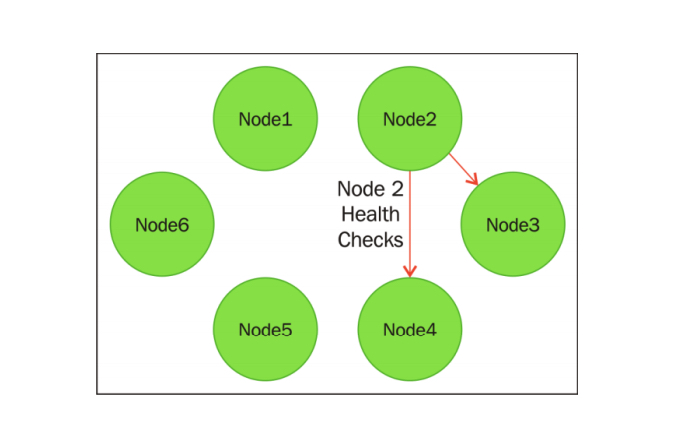
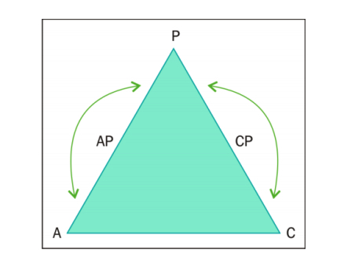
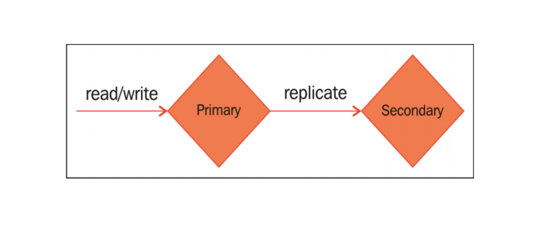
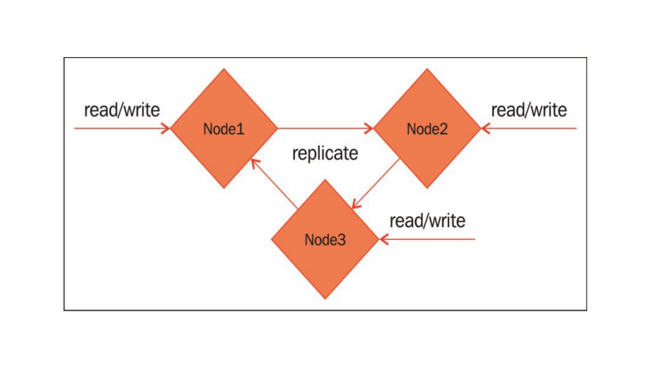
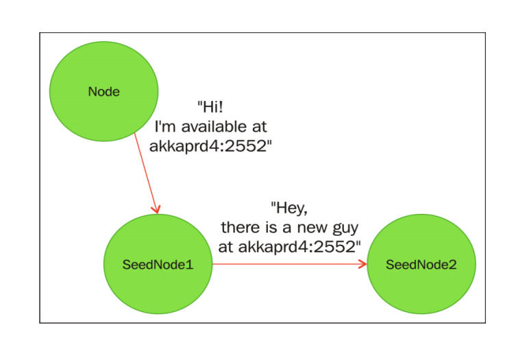
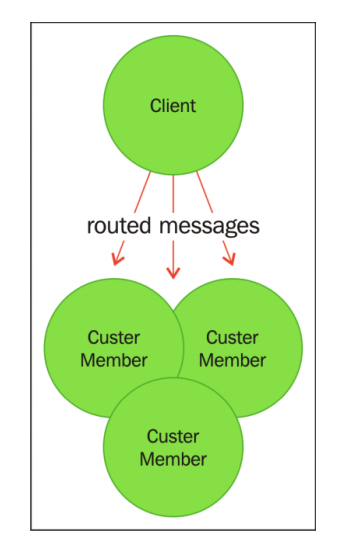

### 6 横向扩展——集群化
#### 6.3 集群的定义
##### 6.3.1 失败检测
集群中的节点通过互相发送消息来确定对方是否可用。节点基于能否获得其他节点的响应来确定其他节点是否可用。

如果集群中的每台服务器都需要和其他所有服务器进行通信，那么集群的性能不会随着节点的增加而线性提高。原因在于每增加一个节点，需要的`通信开销`都会`指数增加`。Akka 中的失败检测只会监控某个节点附近特定数目的节点.


在 Akka 中，失败检测是通过在节点间发送`心跳消息`并接收响应来完成的。Akka 会根据心跳的历史记录以及当前的心跳信息计算出某个节点可用的可能性。Akka 会依照这些数据和配置的容错限制得到计算结果，然后将节点标记为可用或不可用。


##### 6.3.2 通过 gossip 协议达到最终一致性
[gossip简介](https://www.cnblogs.com/xingzc/p/6165084.html)

#### 6.4 CAP 理论
##### 6.4.1 C 一致性(Consistency)
一致性会返回某条记录最新的值
##### 6.4.2 A 可用性(Availability)
可用性是指一个没有发生失败的节点能够返回一个合理的响应例如，给出某个写操作是否成功的精确描述。

##### 6.4.3 P –分区容错性(Partition Tolerance)
分区容错性指的是如果某个节点由于暂时的网络错误而被从网络中移除，那么系统可以继续正常运行。如果数据被冗余备份到三个节点，那么如果其中一个节点暂时变得不可用，而另两个节点仍然能够正常运行

##### 6.4.4 CAP 理论中的妥协

cap只能够选择满足其中两个.
###### CP 系统–一致性优先
最简单的`强一致性`数据库的例子也许有一个 `master` 节点和任意数量包含冗余备份的附属节点。数据永远会在 master 节点写入，而如果要确保读取最新的数据，那么页必须要从 master 节点读取。如果 master 节点发生错误，那么系统就不再可用。

可以采取一些应对错误的机制，比如让某个附属节点成为新的 master 节点。因为 master 节点发生故障的时候我们无法从系统中读取数据，也无法写入数据，所以我们`放弃了可用性`，而是启动错误处理过程，选出新的 master 节点。一旦错误处理过程完成，系统的可用性就恢复了。`Redis Sentinel` 和具备冗余备份的 `RDBMS` 都是`强一致性分布式`系统的很好的例子。
###### AP 系统–可用性优先
选择支持可用性和分区容错性，并牺牲一致性的系统被称为具有“最终一致性”。在高可用的分布式数据库(如 Cassandra 和 Riak)中，这是一种非常常见的模型

当我们写入数据时，数据会被写入到其中 1 个节点，然后会被复制到其余 2 个节点。无论写入的是哪个节点，该节点都会负责把数据同步到其他节点.从一个节点读取数据时，只需要访问一个节点就够了。所以客户端可以任意选择一个节点读取。在这个例子中，因为从某个节点读取数据时，数据可能并不是最新的(`不具备一致性`)，所以我们的系统具备最终一致性。但是由于我们可以从任何一个节点读取数据，也可以向任何一个节点写入数据，所以系统具备分区容错性和高可用性。 如果某个节点变得不可用，我们可以直接尝试使用另一个节点。


###### 灵活的一致性程度
在 3 个特性之间的权衡并不是非黑即白的，其实可以`平缓地过渡`。

在一个最终一致性系统中，记录有 3 个冗余备份，可以选择从任意一个节点读取数据，这样一致性就比较弱.也可以选 择其中任意两个节点返回数据，这样一致性就提升了。可以向所有 3 个节点请求返回结果，这样就能提供`最高的一致性`。

当我们从 3 个节点中得到返回数据时，有多种不同的机制可以用来对返回的记录排序，我们可以选择最新的数据。但是，这么做会`牺牲分区容错性`。如果我们需要所有 3 个备份都可用，那么就无法容忍其中任何一个消失。很多时候，只要求特定数量的节点或是`大多数节点可用`并且能返回`一致的结果`是在一致性和分区容错性中进行权衡的一个不错的方法。

同样，在一个 CP 系统中，我们可以允许从附属节点读取数据，牺牲一部分一致性来获取更高的`可用性`。如果保持仍然只能向 master 节点写入数据，那么我们还是有高一致性的写入操作，但是允许读取操作最终一致，所以数据库在`读取操作`上就变成 AP 系统了。


#### 6.5 使用 Akka Cluster 构建系统
##### 6.5.1 创建集群
###### 项目配置
```hocon
akka {
  actor {
    provider = "akka.cluster.ClusterActorRefProvider"
  }
  remote {
    netty.tcp {
      hostname = "127.0.0.1"
      port = 2552
    }
  }

  cluster {
    seed-nodes = [
      "akka.tcp://Akkademy@127.0.0.1:2552",
      "akka.tcp://Akkademy@127.0.0.1:2551"
    ]
  }

  akka.extensions = ["akka.cluster.client.ClusterClientReceptionist"]
}
```
###### 种子节点
集群中可以包含任意数量的节点，我们可能不知道所有节点的地址。部署在云端的时候，部署的拓扑和 IP 地址可能经常变化。

有 `gossip` 协议，只要知道几个节点的位置就可以解决这个问题了。大多数技术(比如 Cassandra 和 Akka)把这些节点称作`种子节点`。

当一个新节点加入集群时，该节点会尝试连接第一个种子节点。如果成功连接种子节点，新节点就会发布其地址(主机和端口)。种子节点会负责通过 `gossip` 协议将新节点的地址最终通知整个集群。如果连接第一个种子节点失败，新节点就会尝试连接第二个种子节点。只要成功连接任何一个种子节点，那么任何节点加入或离开集群时，我们都不需要对配置进行任何修改。

部署到生产环境时，应该至少定义两个拥有固定 IP 的种子节点，并且保证任何时候都`至少有一个种子节点可用`。当一个节点尝试加入集群时，会试图顺序连接种子节点。 如果所有的种子节点都不可用，那么新节点将无法加入到集群


###### 订阅集群事件
###### 启动集群
###### 优雅地退出集群
试图通过杀死(kill)进程来关闭某个节点的话，就会发现 Akka 会把这个节点标记为不可到达，然后输出一些错误信息。在这种情况下，关闭节点会导致该节点无法访问，Akka 最终会将其标记为关闭。原因在于我们并没有优雅地退出集群。在将一个节点从集群中删除之前，我们应该通知集群:我们要移除这个节点

1. `cluster.leave(self().path().address())` 
2. 使用 jmx 和命 令行工具来提供优雅删除节点的功能
```shell
./akka-cluster localhost 9552 leave akka.tcp://Akkademy@127.0.0.1:2552
```
9552 是 jmx 端口

##### 6.5.2 集群成员的状态
在底层有一个逻辑上的 leader 节点，负责协调`状态的变化`。集群会从逻辑上对节点进行排序，集群中的所有节点都会遵循这个顺序。排序列表中的第一个节点就是 leader 节点。

Leader 节点会对加入和离开集群的请求做出响应，并修改集群成员的状态。状态改变通过 `MemberEvent` 在集群间发送.
###### 失败检测
集群中的节点可以通过`失败检测`，检测其他节点是否可以到达。当某个节点出于任何原因被检测为不可到达时(比如发生崩溃或是暂时的网络错误)，该节点的状态不会发生变化，但是会被标记为 `MemberUnreachable`.
如果在合理的时间段内该节点又重新变得可达，那么该节点就会重新运行。如果在配置的时间内始终不可到达，那么 leader 节点就会将该节点标记为 Down，该节点将无法重新加入集群。

从功能性的角度来看，也可以直接监控成员状态的变化，但是失败检测的实现其实是基于从集群中收集到的数据计算出的`不可达可能性`(phi)。如果读者想要进一步了解的话， `Cluster Specification` 中有一个失败检测实现方法的链接。

如果节点无法访问并且被标记为 Down，那么该节点在这之后将服务重新加入集群。 结果会产生两个分离的集群(形成所谓的`左右脑`的情况)。目前 Akka 没有解决这个 问题。所以一旦某个节点被标记为 Down，就必须`关闭该节点`，`重新启动`，获得一个新的唯一 ID，才能重新加入集群。

##### 6.5.3 通过路由向集群发送消息
##### 6.5.4 编写分布式文章解析服务

##### 6.5.5 用于集群服务的集群客户端

客户端本身不是集群成员，但是必需知道集群的`拓扑结构`。所以我们将使用 contrib库中的 Akka Cluster Client。

客户端必须知道要将消息发送到哪些 Actor 或 Router，以及由哪些 Actor 或 Router 来响应集群事件
###### 设置服务器项目


